# Grafos

## Observações 
- A definição utilizada nesse documento é a do professor Silvio.

## Definição
> Grafos são conjuntos de vértices V e arestas E (edges).    
> Por definição, um grafo G = (V,E), onde V não pode ser 0, mas E sim.

Isso significa que um grafo não pode ter 0 vértices, mas pode ter 0 arestas.

```java
//implementação de um grafo por matriz
public GrafoMatriz(int quantidadeVertices) {
    this.quantidadeVertices = quantidadeVertices;
    this.matriz = new int[quantidadeVertices][quantidadeVertices];
}
```

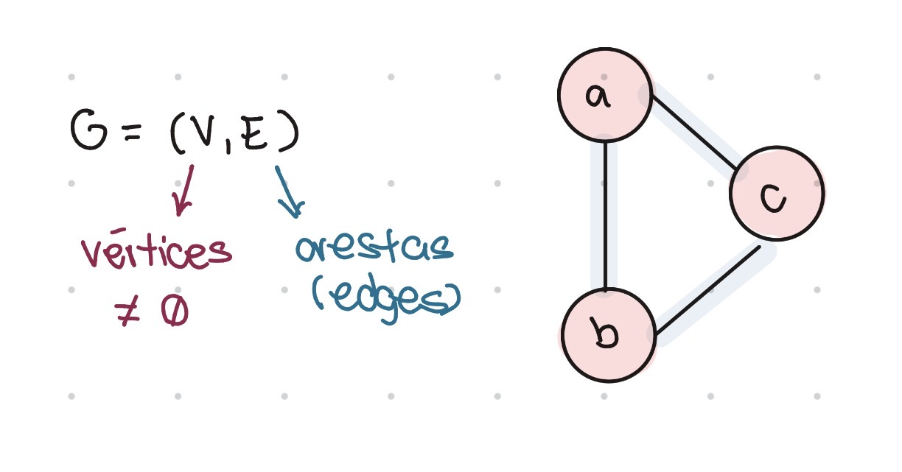

---

## Conceitos básicos 

- Loops: arestas saindo de um vértice e voltando para ele mesmo.
- Arestas paralelas: duas ou mais arestas que possuem a mesma origem e destino.
- Cardinalidade de vértices: quantidade de vértices de um grafo
- Grafos nulos são aqueles que não possuem arestas. 
- Grafos simples são aqueles que não possuem loops e nem arestas paralelas
- Grafos completos são aqueles que possuem todas as relações possíveis entre vértices e arestas. Por definição, eles também devem ser simples.   

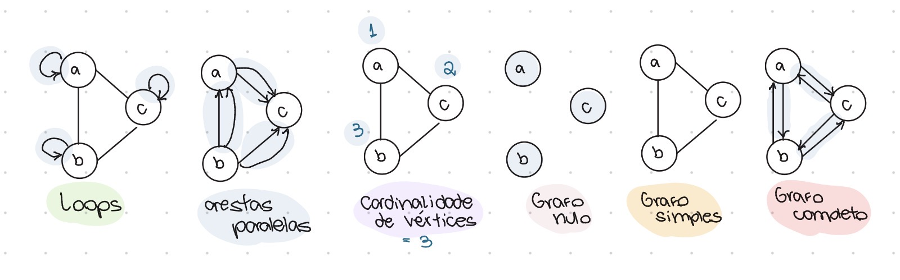

Dois grafos A e B são considerados iguais se A está contido (ou é subconjunto) de B e B 
está contido (ou é subconjunto) de A. Isso significa que mesmo que um grafo tenha arestas paralelas e outro não, eles são considerados iguais. Os dois subconjuntos têm a mesma cardinalidade de vértices, mesmo tendo quantidade de elementos diferentes. 

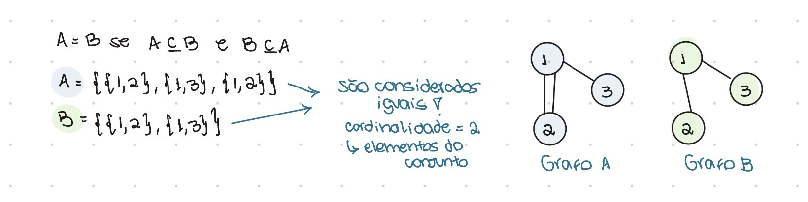

---

## Direcionado vs Não-direcionado
Grafos podem ser direcionados ou não.    
Para grafos direcionados, a direção das arestas importa e usamos parêntesis na sua representação.   
Para grafos não-direcionados, a direção e ordem dos elementos não faz diferença. Para eles, representamos usando chaves.    

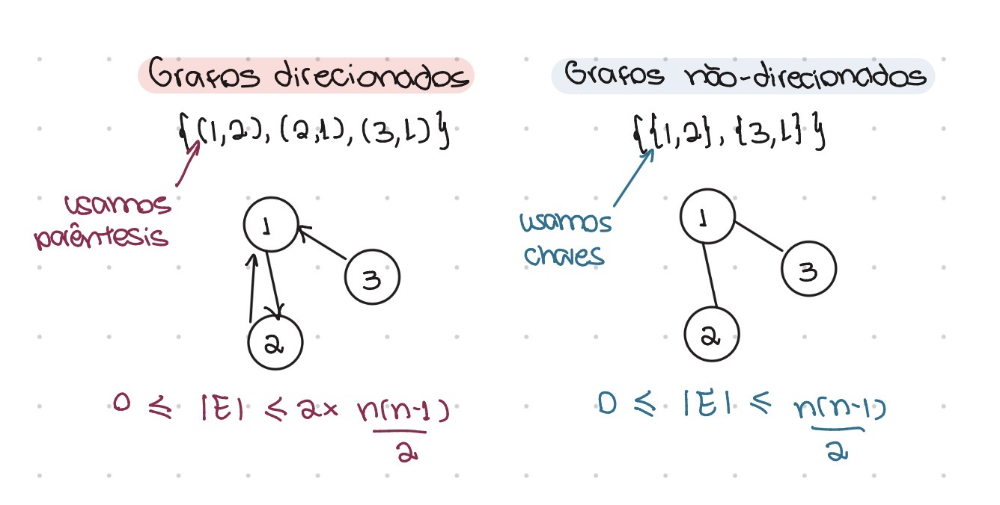

Obs: Em grafos direcionados, (a,b) é diferente de (b,a) porque a apontar pra b e b apontar pra a não são a mesma coisa.   

Para calcular a cardinalidade das arestas, fazemos assim:    
- Direcionado: 0 <= |E| <= 2x fórmula    
- Não-direcionado: 0 <= |E| <= fórmula   

A fórmula pode ser n! / p!(n-p)! ou n(n-1)/2 (combinação de elementos 2 a 2), sendo n a quantidade de vértices.     
No direcionado, a fórmula é multiplicada por 2 pois nesse grafo a ordem dos elementos importa (a setinha possui dois sentidos). No não-direcionado, apenas uma aresta conecta os dois sentidos de um vértice.    

Matematicamente falando:   
(a,b) e (b,a) não são a mesma coisa! (direcionado)    
{a,b} e {b,a} são a mesma coisa! (não-direcionado)   

**obs:** Na hora de representar isso em código, é importante estar atento ao tipo de grafo. Caso ele seja não-direcionado, quando adicionarmos uma aresta (1,2), também devemos adicionar a aresta (2,1).    

---

## Denso vs Esparso
Grafos podem ser densos ou esparsos.     
Grafos densos possuem muitas arestas, sendo mais próximos do grafo completo.     
Grafos esparsos possuem poucas, sendo mais próximos do grafo nulo.

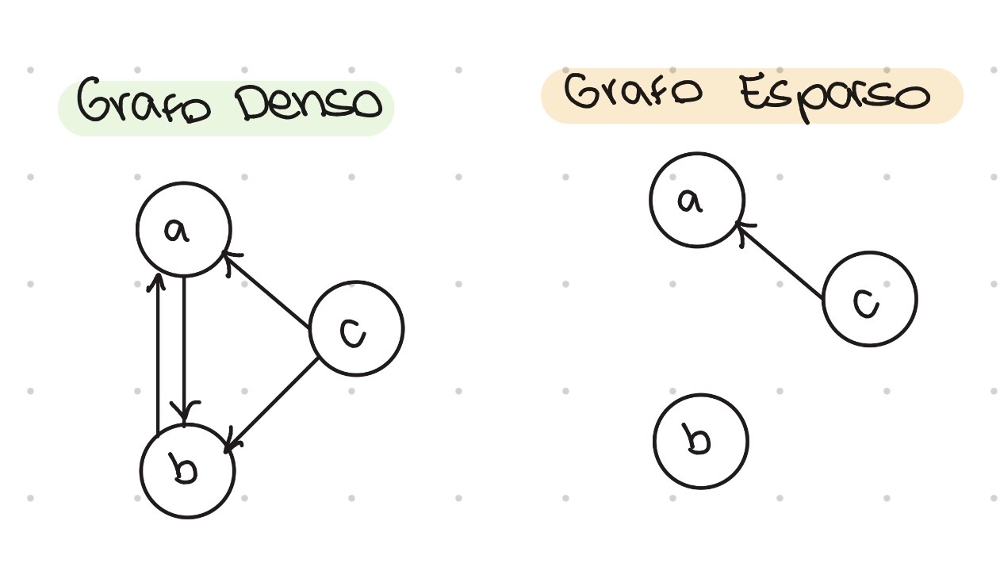

---

## Pesos
Além de vértices e arestas, grafos também podem ter pesos. 

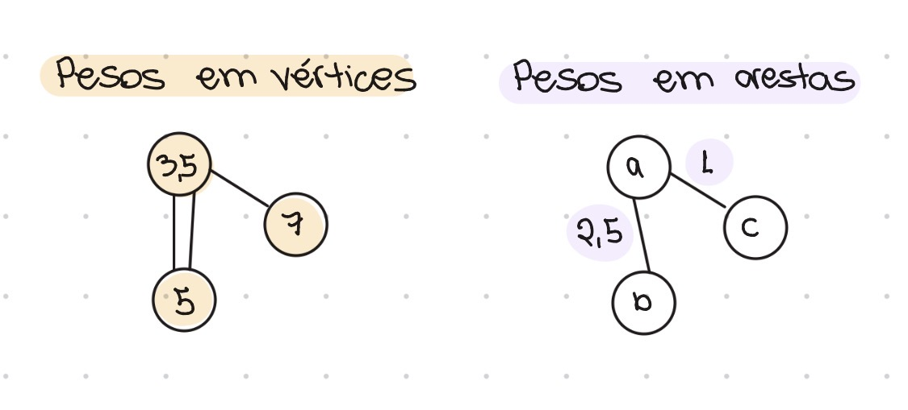

### Pesos em arestas
G = (V,E)   
E = {u,v}, u pertence a V e v pertence a V   

Podemos representar o peso com (G,W), em que G é o grafo constante e W (weight) é uma 
função que mapeia os pesos (W:E -> R)   
Logo, ficaria assim:    
(G,W) = ({u,v},W)   

### Pesos em vértices
Funcionam da mesma forma, porém W:V -> R (função mapeia vértices ao invés de arestas)   

Os pesos podem significar várias coisas, como nome do vértice, nome da aresta (como em ruas).   
Podemos ter um grafo com peso ponderado em arestas e vértices (G, W, Wlinha).    

**obs:** Na implementação de grafos por matriz de adjacência, é importante decidir o tipo de matriz baseado no que será representado (peso, label, arestas paralelas, etc). Caso seja representado apenas a existência de arestas ou não, a matriz pode ser booleana. Caso o peso ou a quantidade de arestas seja representada, a matriz deve ser inteira.

---

## Armazenamento de grafos
No código, os vértices são armazenados em forma de uma lista sequencial, que pode começar de 0 ou 1. Logo, se tivermos 5 vértices, eles poderão ser uma lista de {0,1,2,3,4} ou de {1,2,3,4,5}.    
Para as arestas, temos duas formas de armazenamento:     

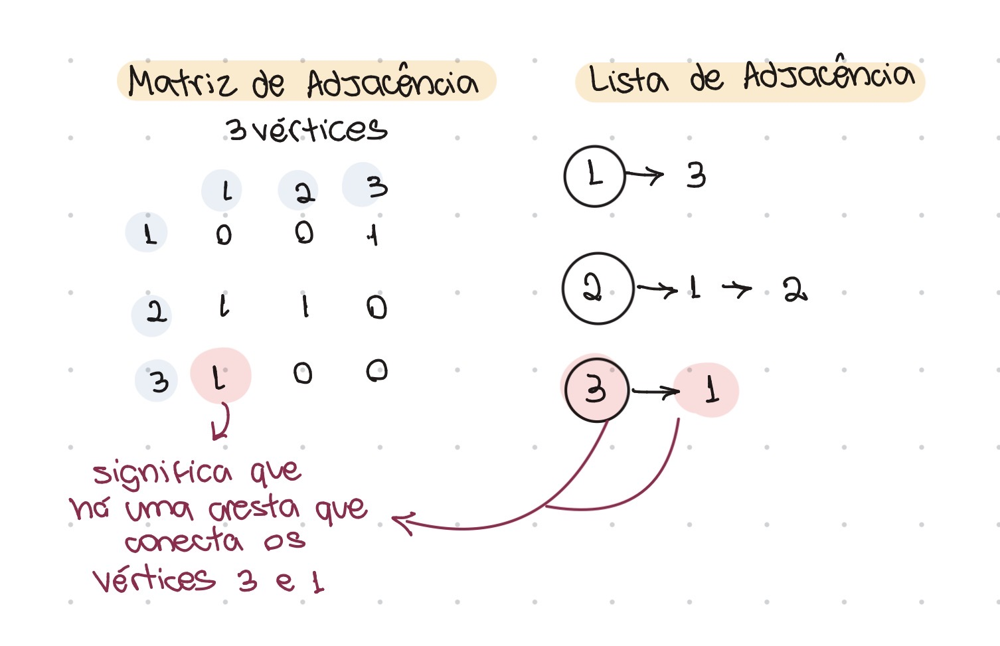

### Matriz de Adjacência: 
Matriz de arestas [1,n] x [1,n]. É sempre uma matriz quadrada de n colunas e n linhas, sendo
n a quantidade de vértices.    

### Lista de Adjacência: 
Arestas formam listas vaseadas nos vértices que indicam as relações.    

Obs: ADJACENTES são vizinhos.    

A seguir, temos alguns exemplos de prós e contras de cada uma.    
**Obs:** de acordo com o professor, é necessário analisar o que é pedido na questão antes de decidir qual das duas estruturas será usada. 

| Estrutura de Dados | Prós | Contras |
| :--- | :--- | :--- |
| **Lista de Adjacência** | • União e inclusão de vértices é comum<br>• Bom para grafos esparsos (ou nulos)<br>• Boa para pesquisar, remover e incluir vértices<br>• Melhor para fusão de vértices | • Ruim para grafos completos<br>• Para pesos, tem que fazer um objeto<br>• Custo adicional de ponteiro<br>• Ruim para pesquisar, remover e incluir arestas |
| **Matriz de Adjacência** | • Boa para grafos completos<br>• Bom para pesquisar, remover e incluir arestas<br>• Fácil de representar grafos direcionados, pesos, labels | • Ruim para grafos nulos ou esparsos (espaço atoa)<br>• Ruim para pesquisar, remover e incluir vértices (caso matriz não tenha espaço para aumentar, seria necessário realocar)<br>• Ruim para fusão de vértices |

**Obs:** Fusão de vértices  
É quando temos dois vértices diferentes com suas arestas próprias e queremos representar todas as suas relações em um novo vértice. Isso é mais fácil de ser feito em listas de adjacência, uma vez que apenas criamos um novo vértice e representamos as relações dos anteriores.   
Para uma matriz, a inclusão e remoção de vértices é difícil pois requer manipulação do espaço da matriz, e muitas vezes realocação. 

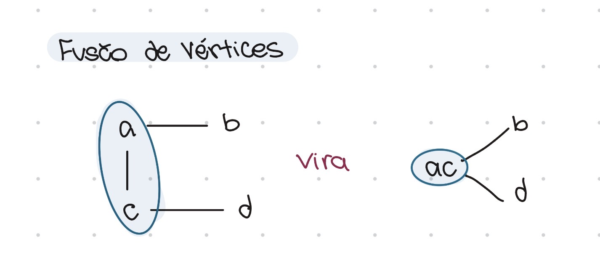


Matrizes podem auxiliar na representação de outras características dos grafos, podendo
ser de vários tipos: 
* **Matriz Booleana (`boolean[][]`):** Indicada para grafos simples e não ponderados. Armazena `true` se existe uma aresta conectando dois vértices e `false` caso contrário.
```java
// 1. Construtor para Matriz Booleana (Presença/Ausência de Aresta)
public class GrafoBooleano {
    private int numVertices;
    private boolean[][] matriz;

    public GrafoBooleano(int numVertices) {
        this.numVertices = numVertices;
        // Inicializa matriz numVertices x numVertices (em Java, o valor padrão é false)
        this.matriz = new boolean[numVertices][numVertices];
    }
}
```

* **Matriz Inteira (`int[][]`):** Utilizada para representar o peso das arestas (grafos ponderados) ou a quantidade de arestas paralelas (múltiplas) existentes entre os vértices.

```java
// 2. Construtor para Matriz Inteira (Pesos ou Arestas Paralelas)
public class GrafoInteiro {
    private int numVertices;
    private int[][] matriz;

    public GrafoInteiro(int numVertices) {
        this.numVertices = numVertices;
        // Inicializa matriz numVertices x numVertices (em Java, o valor padrão é 0)
        this.matriz = new int[numVertices][numVertices];
    }
}
```
* **Matriz de Texto (`String[][]`):** Ideal para atribuir *labels*, rotular conexões ou registrar atributos textuais específicos associados a cada aresta.

```java
// 3. Construtor para Matriz de String (Labels e Atributos Textuais)
public class GrafoString {
    private int numVertices;
    private String[][] matriz;

    public GrafoString(int numVertices) {
        this.numVertices = numVertices;
        // Inicializa matriz numVertices x numVertices (em Java, os elementos iniciam como null)
        this.matriz = new String[numVertices][numVertices];
    }
}
```

---

## Grau

O grau de um vértice é definido por quantas arestas estão conectadas a ele.    
Para grafos direcionados, existe grau de entrada e de saída. 
A quantidade de graus de entrada e saída é sempre igual, uma vez que se entra em um vértice, obrigatoriamente sai em outro. Isso implica que a soma dos dois sempre será par, assim como o grau total de grafos não-direcionados.   

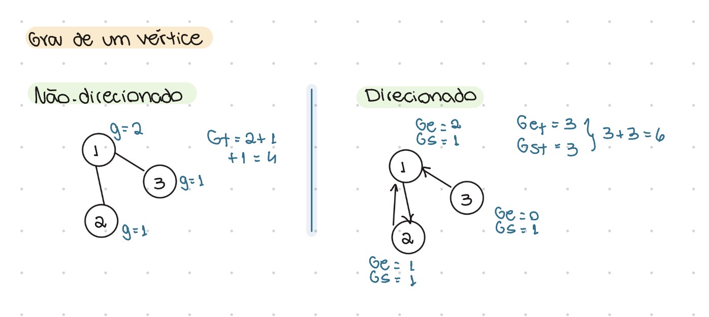

---

## Conectividade 

Grafos conexos são grafos nos quais é possível chegar de b até c mesmo sem ter uma aresta entre eles. Se há uma sequência de vértice-aresta-vértice... entre dois vértices quaisquer, 
há um caminho entre eles. 

**Obs:** Para ser considerado um grafo conexo, todos os vértices devem estar ligados de alguma forma, mas não é necessário ter todas as conexões possíveis. 

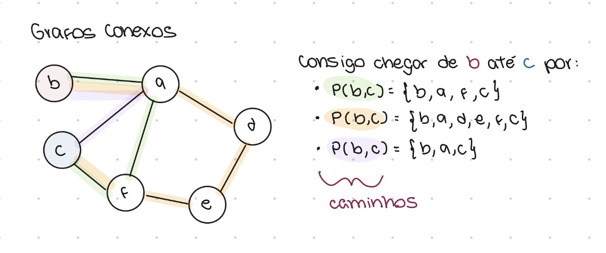

Um *caminho* apenas é válido se o primeiro vértice de P(a,b) for o primeiro do caminho e o último vértice for o último do caminho. Caminhos são considerados simples se não há repetição dos vértices, a não ser a origem.    

- Caminho simples: P(b,c) = {b,a,f,c}   
- Caminho não-simples: P(b,c) = {b,a,d,a,f,c} -> há repetição!

Caminhos que saem de um vértice e chegam nele mesmo são chamados de *ciclos*.    
Para ser considerado um ciclo, o número de arestas percorridas deve ser maior que zero.    
Logo, loops são ciclos (na notação do nosso professor).    

Um caminho que contém ciclos não é um caminho simples, porque para formar um ciclo necessariamente algum vértice é repetido.    

---

## Subgrafos e Componentes Conexos
*Subgrafos* são partes de um grafo, onde seus vértices e arestas estão contidos no grafo inicial. O próprio grafo e o conjunto vazio são considerados subgrafos dele mesmo.   
Para ser subgrafo, não podemos ter arestas sem conectar com vértices!    

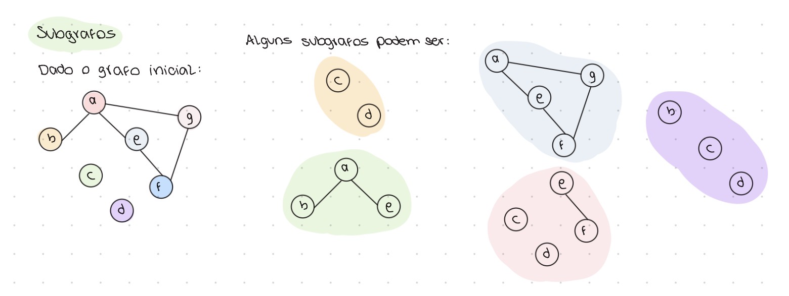

*Componentes conexos* são subgrafos conexos que possuem o maior número de vértices e arestas mantendo a conectividade. Um grafo pode ter vários componentes conexos.    

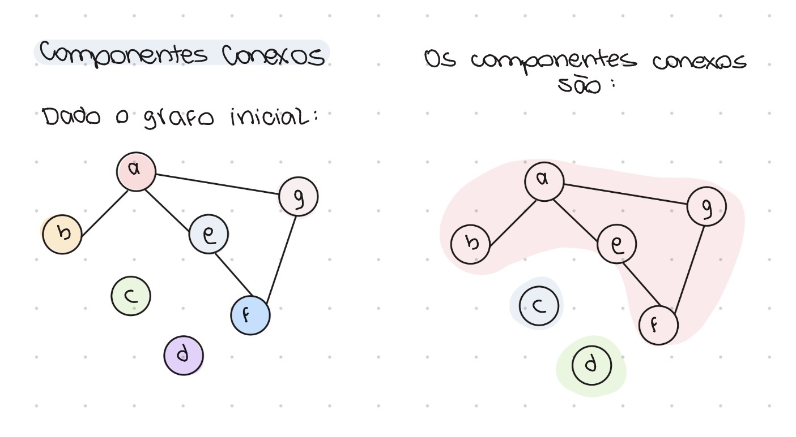