# 🕸️ Grafos

## Observações 
- A definição utilizada nesse documento é a do professor Silvio.

## ⚠️ Definição
> Grafos são conjuntos de vértices V e arestas E (edges).    
> Por definição, um grafo G = (V,E), onde V não pode ser 0, mas E sim.

Isso significa que um grafo não pode ter 0 vértices, mas pode ter 0 arestas.

```java
//implementação de um grafo por matriz
public GrafoMatriz(int quantidadeVertices) {
    this.quantidadeVertices = quantidadeVertices;
    this.matriz = new int[quantidadeVertices][quantidadeVertices];
}
```


---

## Conceitos básicos 

- Loops: arestas saindo de um vértice e voltando para ele mesmo.
- Arestas paralelas: duas ou mais arestas que possuem a mesma origem e destino.
- Cardinalidade de vértices: quantidade de vértices de um grafo
- Grafos nulos são aqueles que não possuem arestas. 
- Grafos simples são aqueles que não possuem loops e nem arestas paralelas
- Grafos completos são aqueles que possuem todas as relações possíveis entre vértices e arestas. Por definição, eles também devem ser simples.   


Dois grafos A e B são considerados iguais se A está contido (ou é subconjunto) de B e B 
está contido (ou é subconjunto) de A. Isso significa que mesmo que um grafo tenha arestas paralelas e outro não, eles são considerados iguais. Os dois subconjuntos têm a mesma cardinalidade de vértices, mesmo tendo quantidade de elementos diferentes. 


---

## ➡️ Direcionado vs Não-direcionado
Grafos podem ser direcionados ou não.    
Para grafos direcionados, a direção das arestas importa e usamos parêntesis na sua representação.   
Para grafos não-direcionados, a direção e ordem dos elementos não faz diferença. Para eles, representamos usando chaves.    


Obs: Em grafos direcionados, (a,b) é diferente de (b,a) porque a apontar pra b e b apontar pra a não são a mesma coisa.   

Para calcular a cardinalidade das arestas, fazemos assim:    
- Direcionado: 0 <= |E| <= 2x fórmula    
- Não-direcionado: 0 <= |E| <= fórmula   

A fórmula pode ser n! / p!(n-p)! ou n(n-1)/2 (combinação de elementos 2 a 2), sendo n a quantidade de vértices.     
No direcionado, a fórmula é multiplicada por 2 pois nesse grafo a ordem dos elementos importa (a setinha possui dois sentidos). No não-direcionado, apenas uma aresta conecta os dois sentidos de um vértice.    

Matematicamente falando:   
(a,b) e (b,a) não são a mesma coisa! (direcionado)    
{a,b} e {b,a} são a mesma coisa! (não-direcionado)   

**obs:** Na hora de representar isso em código, é importante estar atento ao tipo de grafo. Caso ele seja não-direcionado, quando adicionarmos uma aresta (1,2), também devemos adicionar a aresta (2,1).    

---

## Denso vs Esparso
Grafos podem ser densos ou esparsos.     
Grafos densos possuem muitas arestas, sendo mais próximos do grafo completo.     
Grafos esparsos possuem poucas, sendo mais próximos do grafo nulo.


---

## 🏋️ Pesos
Além de vértices e arestas, grafos também podem ter pesos. 


### Pesos em arestas
G = (V,E)   
E = {u,v}, u pertence a V e v pertence a V   

Podemos representar o peso com (G,W), em que G é o grafo constante e W (weight) é uma 
função que mapeia os pesos (W:E -> R)   
Logo, ficaria assim:    
(G,W) = ({u,v},W)   

### Pesos em vértices
Funcionam da mesma forma, porém W:V -> R (função mapeia vértices ao invés de arestas)   

Os pesos podem significar várias coisas, como nome do vértice, nome da aresta (como em ruas).   
Podemos ter um grafo com peso ponderado em arestas e vértices (G, W, Wlinha).    

**obs:** Na implementação de grafos por matriz de adjacência, é importante decidir o tipo de matriz baseado no que será representado (peso, label, arestas paralelas, etc). Caso seja representado apenas a existência de arestas ou não, a matriz pode ser booleana. Caso o peso ou a quantidade de arestas seja representada, a matriz deve ser inteira.

---

## 📦 Armazenamento de grafos
No código, os vértices são armazenados em forma de uma lista sequencial, que pode começar de 0 ou 1. Logo, se tivermos 5 vértices, eles poderão ser uma lista de {0,1,2,3,4} ou de {1,2,3,4,5}.    
Para as arestas, temos duas formas de armazenamento:     


### Matriz de Adjacência: 
Matriz de arestas [1,n] x [1,n]. É sempre uma matriz quadrada de n colunas e n linhas, sendo
n a quantidade de vértices.    

### Lista de Adjacência: 
Arestas formam listas vaseadas nos vértices que indicam as relações.    

Obs: ADJACENTES são vizinhos.    

A seguir, temos alguns exemplos de prós e contras de cada uma.    
**Obs:** de acordo com o professor, é necessário analisar o que é pedido na questão antes de decidir qual das duas estruturas será usada. 

| Estrutura de Dados | Prós | Contras |
| :--- | :--- | :--- |
| **Lista de Adjacência** | • União e inclusão de vértices é comum<br>• Bom para grafos esparsos (ou nulos)<br>• Boa para pesquisar, remover e incluir vértices<br>• Melhor para fusão de vértices | • Ruim para grafos completos<br>• Para pesos, tem que fazer um objeto<br>• Custo adicional de ponteiro<br>• Ruim para pesquisar, remover e incluir arestas |
| **Matriz de Adjacência** | • Boa para grafos completos<br>• Bom para pesquisar, remover e incluir arestas<br>• Fácil de representar grafos direcionados, pesos, labels | • Ruim para grafos nulos ou esparsos (espaço atoa)<br>• Ruim para pesquisar, remover e incluir vértices (caso matriz não tenha espaço para aumentar, seria necessário realocar)<br>• Ruim para fusão de vértices |

**Obs:** Fusão de vértices  
É quando temos dois vértices diferentes com suas arestas próprias e queremos representar todas as suas relações em um novo vértice. Isso é mais fácil de ser feito em listas de adjacência, uma vez que apenas criamos um novo vértice e representamos as relações dos anteriores.   
Para uma matriz, a inclusão e remoção de vértices é difícil pois requer manipulação do espaço da matriz, e muitas vezes realocação. 


Matrizes podem auxiliar na representação de outras características dos grafos, podendo
ser de vários tipos: 
* **Matriz Booleana (`boolean[][]`):** Indicada para grafos simples e não ponderados. Armazena `true` se existe uma aresta conectando dois vértices e `false` caso contrário.
```java
// 1. Construtor para Matriz Booleana (Presença/Ausência de Aresta)
public class GrafoBooleano {
    private int numVertices;
    private boolean[][] matriz;

    public GrafoBooleano(int numVertices) {
        this.numVertices = numVertices;
        // Inicializa matriz numVertices x numVertices (em Java, o valor padrão é false)
        this.matriz = new boolean[numVertices][numVertices];
    }
}
```

* **Matriz Inteira (`int[][]`):** Utilizada para representar o peso das arestas (grafos ponderados) ou a quantidade de arestas paralelas (múltiplas) existentes entre os vértices.

```java
// 2. Construtor para Matriz Inteira (Pesos ou Arestas Paralelas)
public class GrafoInteiro {
    private int numVertices;
    private int[][] matriz;

    public GrafoInteiro(int numVertices) {
        this.numVertices = numVertices;
        // Inicializa matriz numVertices x numVertices (em Java, o valor padrão é 0)
        this.matriz = new int[numVertices][numVertices];
    }
}
```
* **Matriz de Texto (`String[][]`):** Ideal para atribuir *labels*, rotular conexões ou registrar atributos textuais específicos associados a cada aresta.

```java
// 3. Construtor para Matriz de String (Labels e Atributos Textuais)
public class GrafoString {
    private int numVertices;
    private String[][] matriz;

    public GrafoString(int numVertices) {
        this.numVertices = numVertices;
        // Inicializa matriz numVertices x numVertices (em Java, os elementos iniciam como null)
        this.matriz = new String[numVertices][numVertices];
    }
}
```

---

## 🌡️ Grau

O grau de um vértice é definido por quantas arestas estão conectadas a ele.    
Para grafos direcionados, existe grau de entrada e de saída. 
A quantidade de graus de entrada e saída é sempre igual, uma vez que se entra em um vértice, obrigatoriamente sai em outro. Isso implica que a soma dos dois sempre será par, assim como o grau total de grafos não-direcionados.   


---

## Conectividade 

Grafos conexos são grafos nos quais é possível chegar de b até c mesmo sem ter uma aresta entre eles. Se há uma sequência de vértice-aresta-vértice... entre dois vértices quaisquer, 
há um caminho entre eles. 

**Obs:** Para ser considerado um grafo conexo, todos os vértices devem estar ligados de alguma forma, mas não é necessário ter todas as conexões possíveis. 


Um *caminho* apenas é válido se o primeiro vértice de P(a,b) for o primeiro do caminho e o último vértice for o último do caminho. Caminhos são considerados simples se não há repetição dos vértices, a não ser a origem.    

- Caminho simples: P(b,c) = {b,a,f,c}   
- Caminho não-simples: P(b,c) = {b,a,d,a,f,c} -> há repetição!

Caminhos que saem de um vértice e chegam nele mesmo são chamados de *ciclos*.    
Para ser considerado um ciclo, o número de arestas percorridas deve ser maior que zero.    
Logo, loops são ciclos (na notação do nosso professor).    

Um caminho que contém ciclos não é um caminho simples, porque para formar um ciclo necessariamente algum vértice é repetido.    

---

## Subgrafos e Componentes Conexos
*Subgrafos* são partes de um grafo, onde seus vértices e arestas estão contidos no grafo inicial. O próprio grafo e o conjunto vazio são considerados subgrafos dele mesmo.   
Para ser subgrafo, não podemos ter arestas sem conectar com vértices!    


*Componentes conexos* são subgrafos conexos que possuem o maior número de vértices e arestas mantendo a conectividade. Um grafo pode ter vários componentes conexos.    


---

## 🔒 Fechos transitivos
Um conjunto de vértices que é atingido a partir de um vértice u marcado é chamado de *fecho*
*transitivo direto*.   
Um conjunto de vértices que atinge um determinado vértice u é chamado de *fecho transitivo*
*inverso*.    

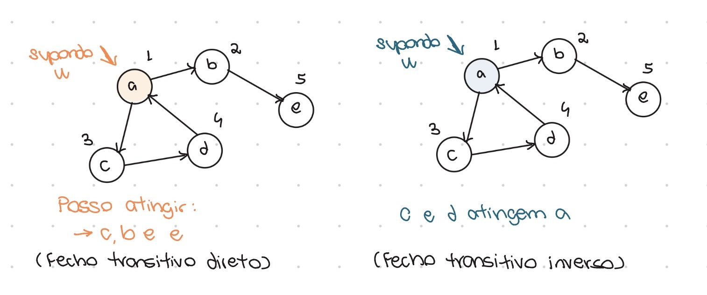

Para grafos não-direcionados, o fecho transitivo direto seriam todas as arestas (componente conexo do meu grafo). Em nossa definição, consideramos que o fecho transitivo direto possui o próprio vértice, uma vez que fechos transitivos são um conjunto de caminhos e existem caminhos com a mesma origem e destino.   

**Obs:** Caminhos são sequências de vértices e arestas. Porém, existem caminhos como P(b,b) que 
não necessariamente tem arestas. Esses são chamados de **caminhos triviais**. 

> A existência de uma aresta implica na existência de um caminho. 
> Porém, a existência de um caminho não implica na existência de uma aresta. 

Isso se deve a existência de caminhos triviais.   

Um grafo de um vértice apenas tem como fecho transitivo direto ele mesmo na pior das hipóteses, o que também implica que esse vértice é um componente conexo.    

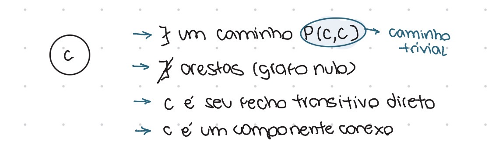

### Tamanho dos caminhos
O tamanho dos caminhos pode ser dado a partir da contagem de vértices ou arestas, dependendo
da definição usada pelo livro ou autor.   

Para caminhos triviais, o tamanho é 0 se contado por aresta (não há arestas), mas é 1 se contado
por vértice (há apenas um vértice).

**Obs:** Quando falamos de caminho, agora, estamos falando de caminhos simples (não há repetição de vértices). Logo, no exemplo abaixo, há apenas um caminho (simples) para chegar 
do vértice a ao vértice f, e ele será obrigatoriamente o escolhido.  

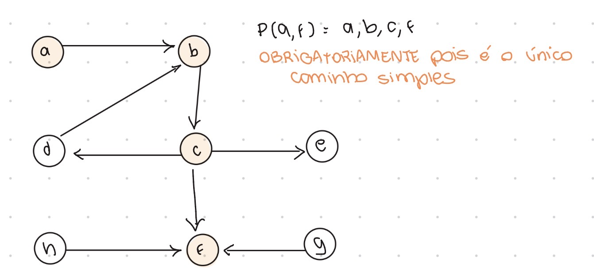

---

## 📝 Classificação das arestas

As arestas de um grafo podem ser classificadas como árvores, cruzamentos, avanços ou retornos.      
Consideramos que:      
      
- 0 = não iniciou a visitação
- 1 = iniciou mas não terminou   
- 2 = terminou   

Podemos percorrê-los assim:   
- 1 -> 0: chamamos a aresta de árvore 
- 1 -> 2: chamamos ou de avanço ou de cruzamento 
- 1 -> 1: chamamos de retorno (ciclo)

A aresta é chamada de **árvore** quando um vértice é descoberto pela primeira vez.  
A aresta é denominada **avanço** quando já foi descoberta por outro vértice mas agora está sendo descoberta por um de seus ancestrais.    
A aresta é denominada **cruzamento** quando já foi descoberta por outro vértice mas agora está sendo descoberta por um vértice que não é um de seus ancestrais.   
A aresta se chama **retorno** quando forma um ciclo.

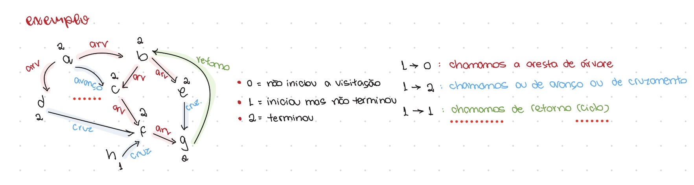

No exemplo acima, as arestas ab, ad, nc, ne, cf e fg são chamadas de **árvores** pois são descobertas pela primeira vez.     
A aresta gb é de **retorno** pois forma um ciclo b,e,g,b.     
As arestas df, eg e hf são de **cruzamento** pois alcançam vértices já descobertos anteriormente por outros ancestrais. Por exemplo: a aresta hf é de cruzamento pois o vértice f foi descoberto anteriormente por c, sendo seus ancestrais: a,b,c. O vértice h não é um de seus ancestrais, formando assim o cruzamento. O mesmo acontece com a aresta eg, pois o vértice g foi previamente descoberto por f, sendo seus ancestrais: a,b,c,f. O vértice e não é um de seus ancestrais, formando assim outro cruzamento.    
Por fim, temos a aresta ac como de avanço. Essa aresta é um avanço pois c foi descoberto antes por b, sendo seus ancestrais a e b. Agora, a está tentando descobrir c. Como a é um de seus ancestrais, consideramos um avanço. Se a não fosse, seria um cruzamento. 

**Obs:** É importante ressaltar que a classificação das arestas não é *fixa*, dependendo assim da ordem que percorremos, como no exemplo acima, a alfabética. Caso a ordem mudasse, a classificação e tempo das arestas mudaria também.   

Mas, o que é o **tempo das arestas**? É o que veremos abaixo.   

---

## ⏱️ Tempos de arestas

Temos uma forma de contar tempos em grafos, contando um "segundo" para cada ação.      
Esses tempos têm relação com a classificação das arestas.      
As arestas árvore e avanço estão dentro estão dentro do subconjunto do seu intervalo inicial, sendo subintervalos. Logo, estão no fecho transitivo direto e são alcançadas.      
Quando é cruzamento, não faz parte do conjunto.      

Com isso em mente, podemos fazer:
-> Busca por profundidade 
-> Busca por lagura

### Conceito de descendentes e ancestrais 
Arestas podem ter descendentes e ancestrais. Uma aresta u é **ancestral** de v quando u alcança v. Uma aresta v é **descendente** de u quando é alcançada por u. 

Por exemplo:

```text
A → B → C
```

Nesse caso:

- `A` é ancestral de `B` e `C`;
- `B` é ancestral de `C`;
- `B` é descendente de `A`;
- `C` é descendente de `A` e `B`.

## Buscas

**Buscas** são formas sistemáticas de percorrer o vértice.   
Por enquanto, vimos duas: 

### Busca em largura
Se parece com uma fila. Está relacionada à distância de vértices para um vértice inicial. 

### Busca em profundidade
Se parece com uma pilha. Está relacionada à existência de um caminho de um vértice inicial até determinados vértices.   
Normalmente, fazemos a busca em profundidade com base na lista encadeada.   
Em árvores, buscas pré-ordem, pós-ordem e central são buscas em profundidade.    

Em muitos casos, tanto a busca em largura quanto a em profundidade chegarão no mesmo resultado, dependendo do grafo.   
Para acharmos componentes conexos e fechos transitivos diretos, por exemplo, podemos usar qualquer uma das duas.   

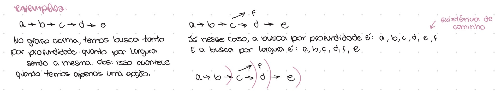

---

## Excentricidade

A **excentricidade** de um vértice é dada pela maior distância desse vértice a outro.   
Ela se difere de **caminho** pois de um vértice u a um vértice v podem existir vários caminhos. Dentre eles, o menor, é a excentricidade.   

### Outros conceitos
- Chamamos de **diâmetro** a maior excentricidade
- Chamamos de **raio** a menor excentricidade
- Chamamos de **centro** o(s) vértice(s) de valor raio

**Obs:** muitas vezes, o raio será metade do diâmetro. Mas isso nem sempre acontece.   

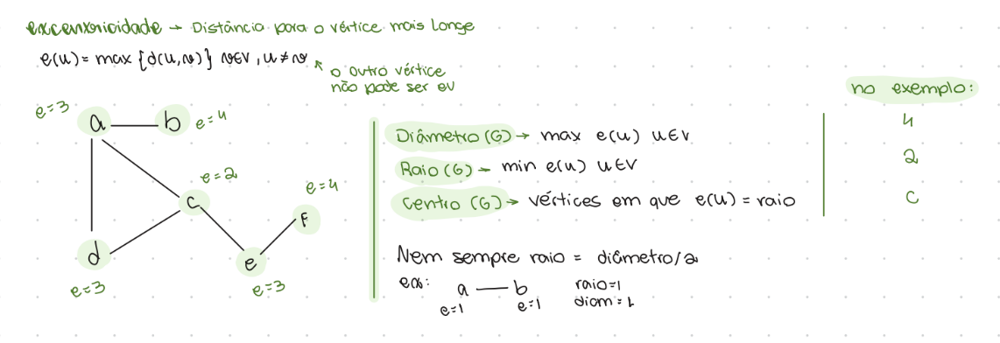

---

## Árvores
Chamamos de **árvore** os grafos que são conexos e acíclicos. Todos os grafos acíclicos formam uma **floresta**. Logo, toda árvore é uma floresta, mas nem toda floresta á uma árvore.  

Em toda árvore, podemos afirmar que teremos vértices de grau um, porque não temos ciclos. 
Logo, sempre teremos uma ponta. Chamamos essa ponta de **vértice pendente**. 

Ao remover o vértice pendente, a excentricidade diminui.   
- Excentricidade par -> número de vértices do caminho é ímpar -> quantidade de arestas é par -> quantidade de vértices é ímpar = um centro
- Excentricidade ímpar -> número de vértices do caminho é par -> quantidade de arestas é ímpar -> quantidade de vértices é par = dois centros 

Todas as árvores possuem centros com no MÁXIMO dois vértices.   
Em árvores, não existe ambiguidade de caminhos, havendo apenas um caminho(u,v). 

**Obs:** Em grafos, para sairmos de uma folha e chegarmos em outra, não precisamos necessariamente passar pelo centro. 

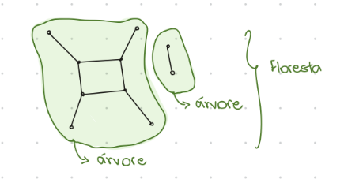

### Raiz 
Nem sempre existirá uma raiz em grafos.   
A raiz apenas existe se existir um vértice que alcança todos os outros. Ou seja, que seu fecho transitivo direto possua todos os vértices do meu grafo. 

--- 

## Classificação de conectividade em grafos

Podemos classificar os grafos quanto a sua conectividade. Sendo assim, temos 4 opções: 

### Grafos fortemente conexos
Se existe caminho de ida e de volta entre todos os vértices de um grafo, ele é considerado um grafo fortemente conexo. 
Isso significa que existe path(u,v) e existe path(v,u) para quaisquer par de vértices. 

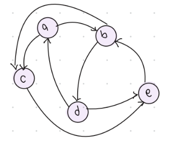

### Grafos semi fortemente conexos
Se existe caminho de ida, mas não de volta (ou de volta, mas não de ida) entre todos os vértices de um grafo, chamamos de semi fortemente conexo. 
Isso significa que existe path(u,v) ou existe path(v,u) para quaisquer par de vértices. 

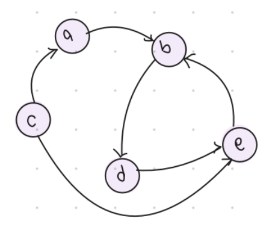

### Grafos fracamente conexos
Se for falso para as duas acima, removemos a direção do grafo, transformando-o em um grafo associado. Se ele for conexo no grafo associado, chamamos ele de fracamente conexo, ou simplesmente conexo. 

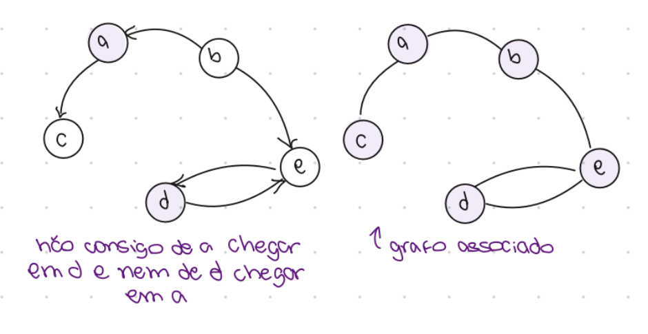

### Grafos desconexos 
Se mesmo no grafo associado (removendo a direção) o grafo ainda não apresentar conectividade, chamamos ele de grafo desconexo. Isso normalmente acontece para grafos nos quais possuímos vértices sozinhos. 

**Obs:** Grafos associados são grafos é o grafo não direcionado que você obtém ao remover a direção de todas as arestas de um grafo direcionado. 

**Obs 2:** Subgrafos de um grafo podem ser chamados de induzidos. Isso significa que ele contém as mesmas arestas que o grafo original, dado os vértices do subgrafo.  

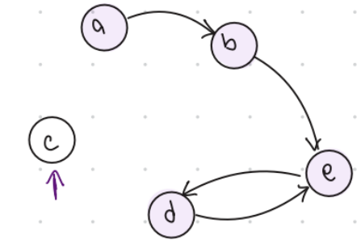

### Componentes conexos 

Componentes conexos são subgrafos maximais fortemente conexos. Eles são partes de um grafo direcionado onde existe um caminho de ida e volta entre qualquer par de vértices, e que não podem ser ampliadas com novos vértices sem perder essa propriedade.   

Componentes conexos são normalmente encontrados onde há ciclos.   
Se o número de componentes fortemente conexos for igual ao número de vértices, não tem ciclo, e logo cada vértice é seu próprio componente.  

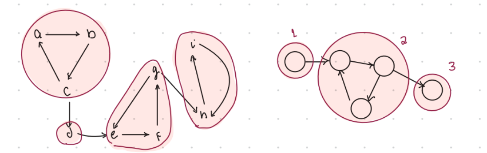

---

## Bases

Uma base é um conjunto de vértices (podendo ser um só) que juntos alcançam todos os vértices do meu grafo. Isso significa que a união dos fechos transitivos diretos desse conjunto equivale ao total de vértices do meu grafo.   

Para identificar uma base, é fácil! Podemos apenas retornar todos os vértices.   
Fica um pouco mais difícil se quisermos identificar uma base de vértice com a menor quantidade possível.   

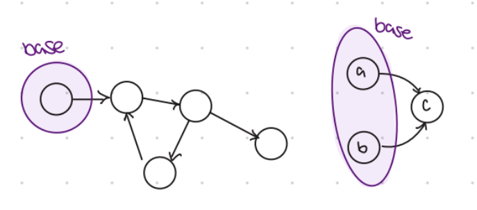

### Para grafos acíclicos: 

A base é formada por todos os vértices de grau de entrada = 0. Isso porque se nenhuma aresta chega nesse vértice, ele obrigatoriamente deve estar incluso na base, uma vez que o fecho transitivo direto de nenhum outro vértice conterá ele, apenas o dele mesmo. 

### Para grafos cíclicos: 

Como apenas sabemos trabalhar com grafos acíclicos, devemos transformar os grafos cíclicos em acíclicos para podermos aplicar a mesma lógica.    
Para isso, transformamos em um vértice cada componente fortemente conexo.   
Assim, o grafo se torna acíclico e aí passamos a ter vértices com grau de entrada = 0.   
Por fim, para montar a nossa base, basta analisar os "vértices" com grau de entrada zero e selecionar qualquer vértice desse componente. 

**Passo a passo**
1. Encontre componentes fortemente conexos 
2. Fusione os vértices de um mesmo componente 
3. Ache um novo grafo: conecte os vértices fundidos caso haja arestas entre vértices de dois componentes conexos diferentes. 
4. Procure vértices de grau de entrada = 0
5. Monte sua base com todos esses vértices. Caso um dos componentes tenha grau de entrada zero, inclua qualquer vértice desse componente. 

**Obs:** Podemos incluir qualquer vértice do componente porque por serem ciclos, qualquer um dos vértices chega em todos os outros.

### Outros conceitos
- Grafos transpostos são aqueles em que alteramos todas as direções das arestas
- Bases em grafos transpostos são chamadas de **antibase**. Isso significa que no grafo normal, eles possuem grau de saída = 0. 
- Uma base com apenas um vértice é chamada de **raiz**. 
- Uma antibase com apenas um vértice é chamada de **antiraiz**. 

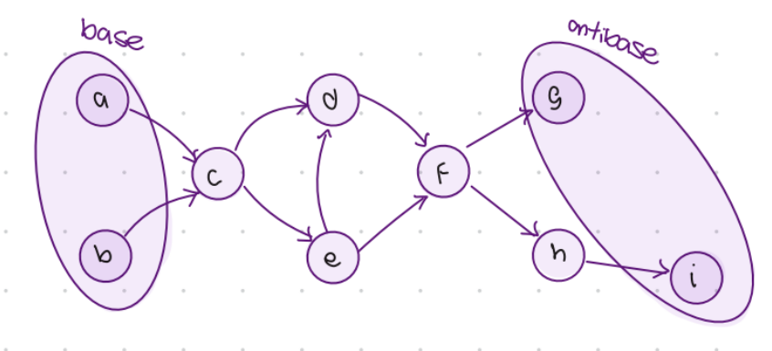

---

## Ordenação Topológica

A ordenação topológica é uma organização linear dos vértices de um grafo direcionado acíclico. 

Ela consiste em numerar os vértices de um grafo direcionado acíclico, de forma que: 
- Os números são iguais para um mesmo vértice
- Em uma aresta (u,v), o número de u deve ser menor que o de v. 

Primeiro, analisamos quem tem grau zero e numeramos com os menores valores (base).   
Depois, removemos a base e passamos a numerar quem tem grau zero (nova base).   
Essa operação se repete até que todos os vértices tenham sido numerados.   

A **ordenação topológica** não é única. Nos nossos estudos, precisamos achar apenas uma delas, e não todas. A partir disso, conseguimos achar o tamanho e os vértices que constituem o maior caminho de um grafo.   

Essa ordenação pode ser usada na vida real para várias coisas, dentre elas: 
- Descobrir tarefas que podem ser feitas em paralelo 
- Otimizar projetos ou saber a duração mínima deles 
- Saber a ordem de precedência de uma grade curricular

A **ordenação topológica** é sequencial, atuando apenas onde não tem ciclos. Em grupos com ações paralelas, a ordem dos vértices não importa. 

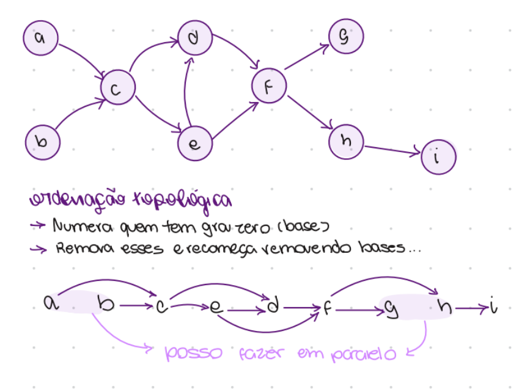

--- 


